# LookingGlass: Advanced Face Recognition System


LookingGlass is a production-grade distributed face recognition system that combines state-of-the-art computer vision techniques with efficient vector search capabilities. It's designed to process, analyze, and match faces across large datasets with high accuracy and performance.

It features an intelligent web crawler with advanced anti-detection capabilities, asynchronous processing pipeline, graph analytics for entity relationships, and a modern web interface for both face recognition and text search functionality.

## 🌟 Key Features

### Production-Grade Face Detection with RetinaFace

- **State-of-the-art RetinaFace** deep learning model for robust face detection
  - Superior performance in challenging conditions (occlusions, angles, lighting)
  - Built-in face alignment capabilities
  - High-precision facial landmark detection (eyes, nose, mouth)
  - Confidence scoring for each detection
  - Handles multiple faces in crowded scenes
- **Multi-model detection pipeline**:
  - RetinaFace as primary detector
  - Face_recognition (dlib) for 128-dimensional embeddings
  - Smart detection fusion with retry mechanisms
  - Confidence-based filtering (50%+ threshold)

### Asynchronous Processing Pipeline

- **Redis Queue (RQ) Integration**:
  - MinIO bucket notifications trigger automatic processing
  - Multiple GPU workers for parallel face recognition
  - Asynchronous job processing with retry capabilities
  - Real-time job monitoring and queue statistics
  - Scalable worker architecture (2+ workers per GPU)
- **Event-driven Architecture**:
  - Automatic processing on file uploads
  - Cleanup jobs for deleted items
  - Support for both image and video processing
  - Audio extraction and transcription from videos

### Graph Analytics & Entity Extraction

- **Neo4j Knowledge Graph**:
  - Named Entity Recognition (NER) with GLiNER
  - Relationship extraction using REBEL transformers
  - Organization, person, location, and project entities
  - Automatic relationship mapping and graph construction
- **Advanced Analytics**:
  - PageRank scoring for entity importance
  - Community detection with Louvain algorithm
  - Shared person relationships between organizations
  - Scheduled daily analytics runs

### Enhanced Web Interface

- **Dual-Mode Search Interface**:
  - Face recognition search with image upload
  - Text search for dialogue and transcriptions
  - Real-time face detection visualization
  - Interactive result presentation
- **Modern Design**:
  - Responsive, mobile-friendly interface
  - Face bounding box visualization
  - Confidence score indicators
  - Source URL linking and metadata display

### Intelligent Web Crawler

- **Playwright-Based Crawling** (Patchright):
  - Advanced anti-detection capabilities
  - Realistic browser behavior simulation
  - Dynamic content handling with JavaScript
  - Automatic proxy rotation and failover
- **Enhanced Stealth Features**:
  - Webdriver property masking
  - Plugin and language simulation
  - Realistic headers and user agents
  - Comprehensive bot detection evasion
- **Content Processing**:
  - HTML page extraction for NER processing
  - Media file detection and processing
  - Metadata preservation and URL tracking

### Audio & Video Processing

- **Speech-to-Text Transcription**:
  - SpeechBrain integration for audio processing
  - Automatic audio extraction from videos
  - Transcription storage and indexing
- **Video Processing**:
  - Frame-by-frame face detection
  - Temporal face tracking
  - Keyframe extraction and analysis
  - Support for multiple video formats

### Vector Search & Storage

- **Qdrant Vector Database**:
  - 128-dimensional face embeddings
  - Cosine similarity matching
  - Efficient metadata indexing
  - Real-time similarity search
- **MinIO Object Storage**:
  - Scalable file storage with metadata
  - Bucket notifications for processing triggers
  - Automatic cleanup and organization
  - Image and video file management

## 🚀 Performance

- **Face Detection**: High accuracy with RetinaFace
- **Asynchronous Processing**: Non-blocking uploads with background processing
- **Scalable Architecture**: Multiple GPU workers, horizontal scaling
- **Sub-second Query Times**: Optimized vector search
- **GPU Acceleration**: CUDA support for 10x+ speedup

## 🛠 Technical Stack

### Core Technologies

- **Python 3.10+** with virtual environments
- **CUDA 11.8** support for GPU acceleration
- **Docker & Docker Compose** for containerization
- **Redis 8.2** for job queuing and coordination

### Machine Learning & CV

- **TensorFlow 2.11.1** and **PyTorch 2.2.0**
- **OpenCV 4.8+** for image processing
- **RetinaFace 0.0.17** for face detection
- **Face_recognition 1.3.0** for embeddings
- **SpeechBrain** for speech-to-text
- **GLiNER** for named entity recognition
- **Transformers 4.41.0** for relationship extraction

### Infrastructure & Storage

- **Qdrant** vector database for embeddings
- **MinIO** object storage with notifications
- **Neo4j** graph database with GDS
- **Redis Queue (RQ)** for job processing

### Web & Crawling

- **Flask** web framework
- **Scrapy 2.9+** with **Playwright** (Patchright)
- **Advanced anti-detection** middleware
- **Proxy rotation** with automatic failover

## 📊 Architecture

```mermaid
graph TB
    %% User Interface Layer
    WebUI["🌐 Web UI<br/>Lookup Interface"]
    User["👤 User"]
    
    %% Data Collection Layer
    Crawler1["🕷️ Crawler 1<br/>Anti-Detection"]
    Crawler2["🕷️ Crawler 2<br/>Playwright"]
    
    %% Storage Layer
    MinIO["💾 MinIO<br/>Object Storage"]
    Redis["📨 Redis<br/>Message Queue"]
    Qdrant["🔍 Qdrant<br/>Vector Database"]
    Neo4j["🕸️ Neo4j<br/>Knowledge Graph"]
    
    %% Processing Layer
    RQWorker1["⚙️ RQ Worker 1<br/>GPU Processing"]
    RQWorker2["⚙️ RQ Worker 2<br/>GPU Processing"]
    GPUService["🎯 GPU Service<br/>Face Recognition"]
    GraphWorker["📊 Graph Worker<br/>NER & Relations"]
    Analytics["📈 Analytics<br/>Daily Scheduling"]
    
    %% Data Types
    Images["🖼️ Images"]
    Videos["🎬 Videos"]
    HTMLPages["📄 HTML Pages"]
    Faces["👤 Face Embeddings"]
    Audio["🎵 Audio/Transcripts"]
    Entities["🏢 Entities & Relations"]
    
    %% User Interactions
    User -->|"Upload Image"| WebUI
    User -->|"Search Text"| WebUI
    WebUI -->|"Face Recognition"| GPUService
    
    %% Crawling Flow
    Crawler1 --> MinIO
    Crawler2 --> MinIO
    
    %% Data Storage
    MinIO --> Images
    MinIO --> Videos
    MinIO --> HTMLPages
    MinIO --> Audio
    
    %% Event-Driven Processing
    MinIO -->|"Bucket Notifications"| Redis
    Redis --> RQWorker1
    Redis --> RQWorker2
    
    %% Face Processing Pipeline
    RQWorker1 -->|"Process Media"| GPUService
    RQWorker2 -->|"Process Media"| GPUService
    GPUService -->|"Store Embeddings"| Qdrant
    
    %% Graph Processing Pipeline
    HTMLPages -->|"NER Processing"| GraphWorker
    GraphWorker -->|"Extract Entities"| Entities
    Entities --> Neo4j
    
    %% Analytics Pipeline
    Neo4j --> Analytics
    Analytics -->|"PageRank & Communities"| Neo4j
    
    %% Search Results
    Qdrant -->|"Similar Faces"| WebUI
    Neo4j -->|"Entity Search"| WebUI
    
    %% Styling
    classDef userLayer fill:#e1f5fe,stroke:#01579b,stroke-width:2px
    classDef storageLayer fill:#f3e5f5,stroke:#4a148c,stroke-width:2px
    classDef processingLayer fill:#e8f5e8,stroke:#1b5e20,stroke-width:2px
    classDef dataLayer fill:#fff3e0,stroke:#e65100,stroke-width:2px
    
    class User,WebUI userLayer
    class MinIO,Redis,Qdrant,Neo4j storageLayer
    class RQWorker1,RQWorker2,GPUService,GraphWorker,Analytics,Crawler1,Crawler2 processingLayer
    class Images,Videos,HTMLPages,Faces,Audio,Entities dataLayer
```



## 📦 Installation

```bash
# Clone the repository
git clone https://github.com/yourusername/lookingglass.git
cd lookingglass

# Build and start all services
docker compose up --build

# Or use the Makefile
make all
```

## 🔧 Configuration

### Environment Variables

#### Core Services
- `QDRANT_HOST`: Qdrant server hostname (default: "qdrant")
- `QDRANT_PORT`: Qdrant server port (default: 6333)
- `QDRANT_API_KEY`: Qdrant API key (default: "qdrantapikey")

#### Storage
- `MINIO_ROOT_USER`: MinIO access key (default: "miniouser")
- `MINIO_ROOT_PASSWORD`: MinIO secret key (default: "miniopassword")
- `MINIO_BUCKET`: Storage bucket name (default: "scraped")

#### Processing
- `REDIS_URL`: Redis connection URL (default: "redis://redis:6379")
- `CUDA_VISIBLE_DEVICES`: GPU assignment for workers

#### Crawler
- `START_URL`: Starting URL for crawling
- `CRAWL_MODE`: Crawling mode (default: "image")

#### Graph Analytics
- `NEO4J_AUTH`: Neo4j credentials (default: "neo4j/password")
- `NEO4J_HOST`: Neo4j server hostname (default: "neo4j")

### Hardware Requirements

- **Minimum 32GB RAM** (recommended 64GB+)
- **NVIDIA GPU** with 8GB+ VRAM per worker
- **500GB+ storage** for media files
- **Multi-core CPU** for parallel processing

## 🔍 Usage

### Web Interface

Access the lookup interface at `http://localhost:5000`

#### Face Recognition Search
- Upload images for face matching
- View real-time face detection boxes
- Browse match results with confidence scores
- Access source URLs and metadata

#### Text Search
- Search dialogue and transcriptions
- Find content across processed videos
- Filter by keywords and phrases

### API Endpoints

#### Face Recognition
```bash
POST /lookup
Content-Type: multipart/form-data
```
Response includes:
- Face locations and bounding boxes
- Match confidence scores
- Source URLs and metadata
- Base64-encoded result images

#### Queue Management
```bash
GET /queue/stats     # Queue statistics
GET /health          # Service health check
```

### Service Management

```bash
# Start specific services
make crawler    # Start crawlers only
make ui         # Start lookup interface
make page       # Start graph analytics

# Monitor services
docker compose logs -f rq-worker-1
docker compose logs -f gpu-service
```

## 🔧 Advanced Configuration

### Scaling Workers

```yaml
# Scale RQ workers
docker compose up -d --scale rq-worker-1=2 --scale rq-worker-2=2
```

### GPU Assignment

```yaml
# Assign specific GPUs to workers
environment:
  - CUDA_VISIBLE_DEVICES=0,1,2
```

### Crawler Configuration

```yaml
# Multiple crawler instances
environment:
  - START_URL=https://example.com
  - CRAWL_MODE=image
```

## 📈 Monitoring

### Queue Statistics
```bash
curl http://localhost:5002/queue/stats
```

### Neo4j Browser
Access at `http://localhost:7474`
- Username: neo4j
- Password: password

### MinIO Console
Access at `http://localhost:9001`
- Username: miniouser
- Password: miniopassword

### Qdrant Dashboard
Access at `http://localhost:6333/dashboard`

## 🐛 Troubleshooting

### Common Issues

1. **GPU Memory Issues**
   - Reduce batch sizes in processing
   - Increase GPU memory allocation
   - Check CUDA_VISIBLE_DEVICES settings

2. **Queue Backlog**
   - Scale RQ workers: `docker compose up -d --scale rq-worker-1=4`
   - Monitor queue stats: `curl http://localhost:5002/queue/stats`

3. **Crawler Blocking**
   - Check proxy rotation logs
   - Verify anti-detection settings
   - Monitor proxy refresh process

4. **Database Connection Issues**
   - Verify service startup order
   - Check network connectivity
   - Review container logs

### Performance Optimization

```bash
# Check resource usage
docker stats

# Monitor queue processing
docker compose logs -f rq-worker-1

# Verify GPU utilization
nvidia-smi
```

## 🤝 Contributing

Contributions are welcome! Please read our [Contributing Guidelines](CONTRIBUTING.md) for details on our code of conduct and the process for submitting pull requests.

## 📄 License

This project is licensed under the MIT License - see the [LICENSE](LICENSE) file for details.

## 🔗 References

- [RetinaFace](https://github.com/serengil/retinaface) - Face detection
- [Qdrant Documentation](https://qdrant.tech/documentation/) - Vector database
- [Redis Queue (RQ)](https://python-rq.org/) - Job processing
- [Neo4j Graph Data Science](https://neo4j.com/docs/graph-data-science/) - Graph analytics
- [Playwright](https://playwright.dev/) - Web automation
- [SpeechBrain](https://speechbrain.github.io/) - Speech processing
- [GLiNER](https://github.com/urchade/GLiNER) - Named entity recognition
